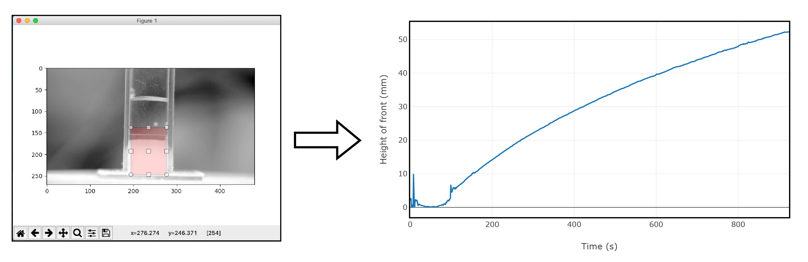

# xptools

Analysis tools for experimental sciences to display images, detect particles (cells, bubbles, crystals), moving fronts and analyze their shape, size and distibution.

## Installation

Install from pip with the command

```
pip install xptools
```

## Scripts

- analyze_front - This scipt takes a directory containing video files. For each file, it asks the user to select a region of interest
and processes the selected area with a minimum threshold to find the largest area. It then plots the height of this area as
a function of time.

```
analyze_front --plotly --scale 60 --framerate 30 moviedirectory/
```



- display_image_matrix - Arranges all the images in a directory as a matrix and saves the resulting image

```
display_image_matrix --lines 10 --compress imagedirectory/
```

## Utilities

Several utilities are included in the submodule utils including:

- select_roi:select_rectangle - Prompts the user to make a rectangular selection on the passed image and returns the coordinates of the selection.

- videotools:open_video - Opens a video file as a list of np.arrays each containing one frame of the video.

- videotools:determine_threshold - Determines the threshold to use for a video based on the minimum threshold algorithm.

- videotools:obtain_cropping_boxes - Prompts the user to select the region of interest for each video file. Returns a dataframe containing the coordinates of the selected area for each file.

- imagetools:open_all_images - Opens all the images in a folder and returns a list of cv2 images.

### Example usage

```python
import pandas as pd
from xptools.utils import videotools

df_crop = obtain_cropping_boxes(['Film1.avi','Film2.avi'])
g_crop = df_crop.groupby('ExpName')

for name in g_crop.groups.keys():
    (minRow, minCol, maxRow, maxCol) = g_crop.get_group[name]['CroppingBox']
    stack = [img[minRow:maxRow,minCol:maxCol] for img in stack]
```

## Notebooks

- BroadSpectrumTesting.ipynb - Tests different image analysis techniques to determine which is most appropriate
- FocusedAnalysis.ipynb - Implements a specific analysis and plots the resulting size and number distributions for the particles

## Credits

Code for display_image_matrix adapted from https://gist.github.com/pgorczak/95230f53d3f140e4939c#file-imgmatrix-py

## License

This project is licensed under the MIT License - see the [LICENSE.md](LICENSE.md) file for details.